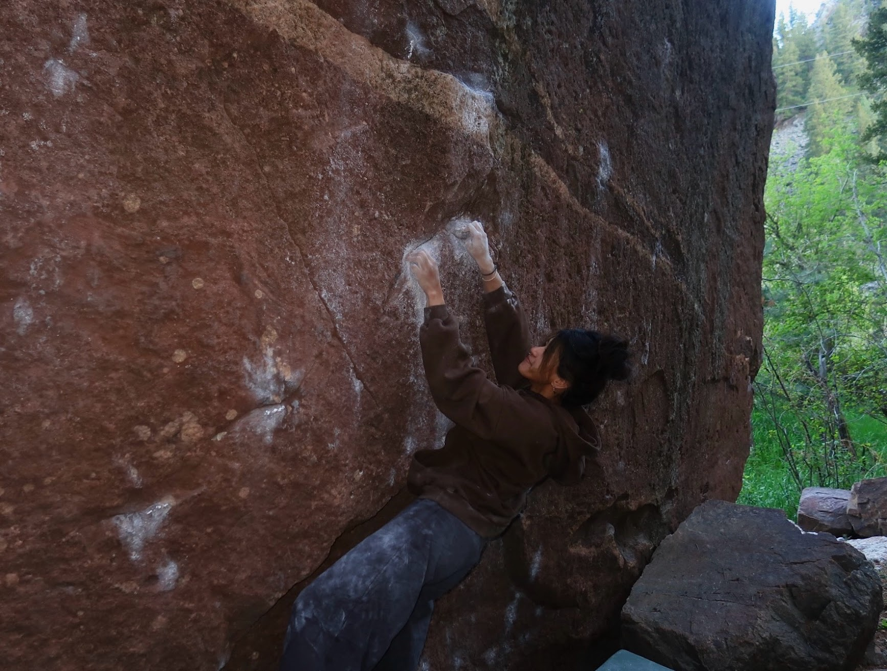

## Hi, I’m Tiana Schwarz 👋
Sustainment Cyber Test Engineer • Junior Software Engineer • Technical Writer

I bridge systems engineering, software development, and technical documentation.  
My background spans **MILSATCOM sustainment testing**, **DoD cybersecurity compliance**, **cloud migration**, and **front-end design** - building solutions that are functional, maintainable, and clearly documented for both engineers and non-technical users.

---

### 🛰️ Current Focus (Security+ Certification and Active SECRET Clearance)
- **Sustainment Test Engineering (Space Systems Command – MILSATCOM)**  
  Automating STIG compliance verification and streamlining configuration validation for hardening government systems.  
  Specialized in PowerShell automation, XML vulnerability mapping, and cross-functional test documentation.

- **Systems Migration Internship (Orchard Alliance)**  
  Migrated legacy financial databases to cloud systems using SQL + Python + C.  
  Coordinated weekly sprints across time zones and led User Acceptance Testing to align dev output with stakeholder intent.

- **Junior Software Engineering and Indie Video Game Projects**  
  Designing interactive tools and UIs that simplify complex processes - blending engineering logic with clean presentation.

---

### 💻 2025's Featured Project: SCC Finals Web App  
**Built for Springs Climbing Center**, this browser-based SOP hub documents and demonstrates event-ready automation scripts.

- React + TypeScript frontend with embedded PowerShell logic  
- Dynamic read-only viewers for scripts like  
  - 🧮 *Drawer Counter v2*  
  - 🧭 *Finals Projector*  
  - ⏱️ *Finals Timer v6.4* (Drift-Free + ±10 s Adjust + Audio Cues)  
- Fully hosted in-browser for staff use - no local install or credentials required  

> Demo the live SOP app here:  
> [**Springs Climbing Center - Operations Hub**](https://2rfr8h.csb.app/)

This project merges **front-end design**, **PowerShell backend logic**, and **technical writing**, presenting complex operational automation as an accessible, well-documented interface.

---

### 🧩 Interests
- Front-End Design & UX for technical environments  
- Technical Documentation & Web SOP systems  
- Systems Automation (PowerShell / Python / React)  
- Climbing 🧗‍♀️ + Community Engineering  

---

### 🌍 Community Involvement
- **L2 USA Climbing Coach** - Coach and mentor at Springs Climbing Center; founded the UCCS Collegiate Climbing Team and led athletes to multiple podium placements at national-level comps.  
- **CSBR Alumni Mentor** - Active mentor through the Colorado Space Business Roundtable, supporting early-career engineers navigating aerospace, cyber, and systems roles.  
- **Colorado Space Grant Consortium Awardee** - Recognized for the IMU-OsteoSuit project analyzing astronaut bone health; presented findings at the CO Space Grant Symposium.  
- **STEM Outreach & Technical Writing** - Develops educational SOPs and documentation templates for staff and student use, translating complex software and cyber workflows into accessible formats for wider adoption.  
- **Community-Driven Developer** - Builds web tools that bridge front-end design, engineering, and documentation - most recently the *SCC Operations SOP Hub*, enabling non-technical climbing staff to interact with automated PowerShell systems through a browser interface.

---

### 🧠 Earlier Projects (Pre-Industry)
Before transitioning fully into the STEM industry, I completed several independent and academic projects that shaped my approach to problem-solving and automation:

- **CragWeather CLI (Python / REST API / JSON)** – Combined OpenWeather and Mountain Project APIs to generate live climbing forecasts for 60+ Colorado areas.  
- **SecureDMF GUI (AES Encryption / Python / Tkinter)** – Encrypted and parsed 10 GB+ federal datasets with AES, integrating NTIS fetch automation for weekly DMF updates.  
- **IMU-OsteoSuit (ArduinoC / MATLAB / Embedded Systems)** – Captured IMU sensor data to study bone-loading patterns in microgravity environments; awarded by the CO Space Grant Consortium.  
- **TechOdyssey Full-Stack App (Ruby on Rails / Docker / CircleCI)** – Deployed a secure full-stack web portfolio using CI/CD principles; later re-hosted on Raspberry Pi for 99% uptime.  
- **Automation Scripts & Micro Projects** – From autonomous TensorFlow vehicle simulations to a JavaScript idle-game automation suite - early explorations that built my foundation in logic, iteration, and applied scripting.

---

### 🔗 Connect
- [LinkedIn](https://www.linkedin.com/in/tschwarz001/)  
- [GitHub](https://github.com/track001)  
- [Portfolio / SOP Demo](https://2rfr8h.csb.app/)

---

> “The pursuit of today.”
