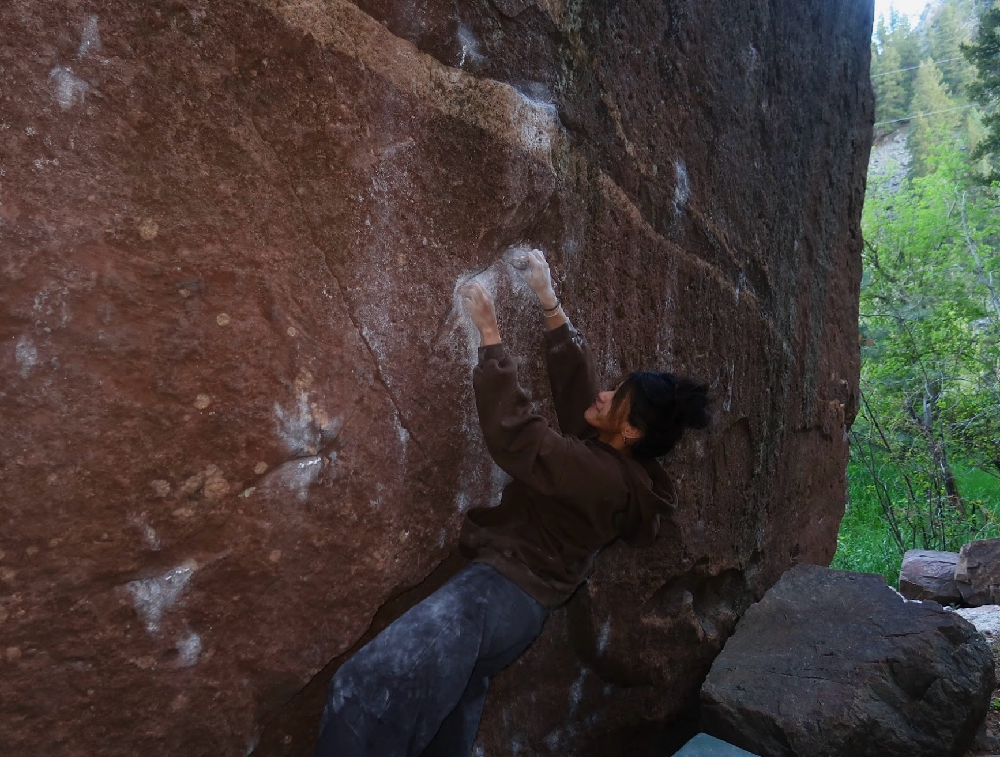

## Hi, I’m Tiana Schwarz 👋
Sustainment Cyber Test Engineer • Junior Software Engineer • Technical Writer • Climber, Coach, and Routesetter

I bridge systems engineering, software development, and technical documentation.  
My background spans **MILSATCOM sustainment testing**, **DoD cybersecurity compliance**, **cloud migration**, and **front-end design** - building solutions that are functional, maintainable, and clearly documented for both engineers and non-technical users.

---

### 📚 UCCS CS Study Resources

Public CS study resources from my time at UCCS, including networking and cybersecurity Quizlet sets I used throughout coursework and exam prep:

> https://quizlet.com/user/schwarztiana/sets

Sharing in case they help other students learning similar material.

---

### 📄 LaTeX Resume Template (Overleaf)

I also maintain a reusable LaTeX resume template for CS students, cybersecurity applicants, engineers, and early-career technical roles.

Built for:
- internships
- technical writing
- software engineering
- cyber / systems engineering
- project-heavy resumes

Includes:
- ATS-friendly formatting
- impact-oriented bullet structure
- technical project sections
- clean Overleaf setup for easy editing

> [View / Copy Resume Template](https://www.overleaf.com/read/mdwcckpyqxxb#1f3aca)

---

## Volunteering in Colorado Springs

A collection of volunteer opportunities and community organizations throughout Colorado Springs that I've researched, volunteered with, or recommend. This guide focuses on organizations addressing homelessness, healthcare access, food insecurity, and support for older adults.

Whether you're looking for a one-time opportunity or a recurring place to serve, my goal is to make it easier to find ways to get involved in the local community.
- 🔗 Repository: https://github.com/track001/VolunteeringinCOS

---

### 🛰️ Current Focus (Security+ Certification and Active SECRET Clearance)

- **Sustainment Test Engineering w/ a Cyber emphasis (Space Systems Command – MILSATCOM)**  
  Automating STIG compliance verification and streamlining configuration validation for hardening government systems.  
  Specialized in PowerShell automation, XML vulnerability mapping, and cross-functional test documentation.

- **🧩 Systems Migration Internship (Orchard Alliance)**  
  Migrated legacy financial databases to cloud systems using SQL + Python + C.  
  Coordinated weekly sprints across time zones and led User Acceptance Testing to align dev output with stakeholder intent.

### 💻 Junior Software Engineering and Indie Game Projects

- Designing interactive tools and UIs that simplify complex processes - blending engineering logic with clean presentation. Experienced in **Unity** development (including VR prototyping from my VR developer contract) and proficient in **front-end scripting, PowerShell, and automation pipelines**.

### 🛡️ Web Services & IT

- **UCCS Office of Information Technology / Web Services** - Supported and maintained university-scale systems for students and faculty. Developed responsive interfaces, debugged live server integrations, and optimized accessibility and UX compliance for institutional web applications.

- **Telstra Infrastructure & Network Operations** - Contributed to enterprise-level network and IT documentation projects, performing system validation, service configuration checks, and user experience testing for distributed teams. Focused on process automation and efficient workflow integration across large-scale networks.

---

### 💻 2025's Featured Project: SCC Finals Web App

**Built for Springs Climbing Center**, this browser-based SOP hub documents and demonstrates event-ready automation scripts.

- React + TypeScript frontend with embedded PowerShell logic
- Dynamic read-only viewers for scripts like
  - 🧮 *Drawer Counter v2*
  - 🧭 *Finals Projector*
  - ⏱️ *Finals Timer v6.4* (Drift-Free + ±10 s Adjust + Audio Cues)
- Fully hosted in-browser for staff use - no local install or credentials required

> Demo the live SOP app here:  
> [**Springs Climbing Center - Operations Hub**](https://2rfr8h.csb.app/)

This project merges front-end design, PowerShell backend logic, and technical writing, inspired by the precision and clarity of Stripe’s developer documentation; often cited as a gold standard in technical writing. It reflects my ongoing goal to achieve that same level of accessibility, elegance, and technical rigor in every interface I design or document.

---

### 🧩 Interests

- Front-End Design & UX for technical environments
- Technical Documentation & Web SOP systems
- Systems Automation (PowerShell / Python / React)
- Climbing 🧗‍♀️ + Community Engineering

---

### 🌍 Community Involvement

- **L2 USA Climbing Coach** - Coach and mentor at Springs Climbing Center; founded the UCCS Collegiate Climbing Team and led athletes to multiple podium placements at national-level competitions. I went on to win the **2024 intermediate collegiate national titles** in both bouldering and sport, while navigating a long recovery from knee surgeries and finger injuries.

- **Escape Climbing Athlete** - Proudly supported by Escape Climbing and aligned with their values of accessibility, craftsmanship, and community-driven design.

- **CSBR Alumni Mentor** - Active mentor through the Colorado Space Business Roundtable, supporting early-career engineers navigating aerospace, cyber, and systems roles.

- **Colorado Space Grant Consortium Scholarship Awardee** - Recognized for the IMU-OsteoSuit project analyzing astronaut bone health; presented findings at the CO Space Grant Symposium.

- **STEM Outreach & Technical Writing** - Develops educational SOPs and documentation templates for staff and student use, translating complex software and cyber workflows into accessible formats for wider adoption.

- **Community-Driven Developer** - Builds web tools that bridge front-end design, engineering, and documentation - most recently the *SCC Operations SOP Hub*, enabling non-technical climbing staff to interact with automated PowerShell systems through a browser interface.

---

### 🧠 Earlier Projects (Pre-Industry)

Before transitioning fully into the STEM industry, I completed several independent and academic projects that shaped my approach to problem-solving and automation:

- **CragWeather CLI (Python / REST API / JSON)** – Combined OpenWeather and Mountain Project APIs to generate live climbing forecasts for 60+ Colorado areas.

- **SecureDMF GUI (AES Encryption / Python / Tkinter)** – Encrypted and parsed 10 GB+ federal datasets with AES, integrating NTIS fetch automation for weekly DMF updates.

- **IMU-OsteoSuit (ArduinoC / MATLAB / Embedded Systems)** – Captured IMU sensor data to study bone-loading patterns in microgravity environments; awarded by the CO Space Grant Consortium.

- **TechOdyssey Full-Stack App (Ruby on Rails / Docker / CircleCI)** – Deployed a secure full-stack web portfolio using CI/CD principles; later re-hosted on Raspberry Pi for 99% uptime.

- **Automation Scripts & Micro Projects** – From autonomous TensorFlow vehicle simulations to a JavaScript idle-game automation suite - early explorations that built my foundation in logic, iteration, and applied scripting.

---

### 🔗 Connect

- [LinkedIn](https://www.linkedin.com/in/tschwarz001/)  
  Professional experience, technical background, and current work.

- [GitHub](https://github.com/track001)  
  Software projects, automation tools, technical documentation, and development work.

- [Linktree](https://linktr.ee/tischwarz)  
  Central hub for study resources, climbing, projects, and social links.

- [8a.nu Climbing Profile](https://www.8a.nu/user/ti-schwarz)  
  Outdoor climbing logbook, ascents, and training progression.

- [Portfolio / SCC Operations Hub](https://2rfr8h.csb.app/)  
  Interactive SOP and automation web app built for Springs Climbing Center.
---

> “The pursuit of today.”
