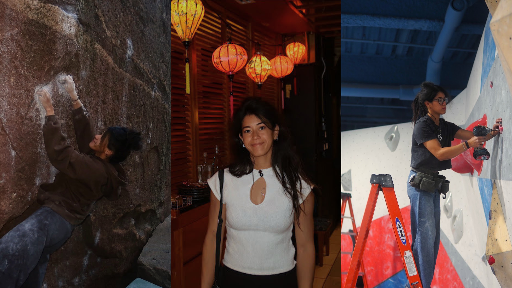

# Hi, I’m Ti (Tiana) Schwarz 🌙☀️

**Cyber Mission Analyst • Sustainment Test Engineer • Technical Writer • USAC L1 Routesetter & L2 Coach**

I’m a computer science graduate working in cyber mission analysis and DoD systems, with a background in sustainment testing, automation, software development, and technical writing.

A lot of the work I enjoy comes down to the same thing: **understanding a complicated system, making it work better, and making it easier for the next person to use.**

Outside of my technical career, climbing has grown into a second professional focus. I’m a USA Climbing L1 Routesetter and L2 Coach, with a particular interest in youth development, para climbing, accessible movement, and competition operations.

This GitHub is a home for both sides of my work, along with the projects and resources I’ve built to help other people along the way.

---

### 🧭 Explore

[**🛰️ Cyber & Mission Systems**](#️-cyber--mission-systems) •
[**💻 Projects**](#-featured-projects) •
[**🧗 Routesetting & Coaching**](#-routesetting--coaching) •
[**🚀 Aerospace & STEM**](#-aerospace-stem--mentorship) •
[**📚 Resources**](#-resources) •
[**📄 Resumes**](#-resumes)

---

## 🛰️ Cyber & Mission Systems

### 📡 Mission Relevant Terrain – Cyber (MRT-C)

I currently support MRT-C mission analysis for U.S. Space Force missions, working with mission threads, systems, network dependencies, and cyber terrain that support mission execution.

My work includes:

- Mapping mission systems and technical dependencies
- Supporting identification of Mission Relevant Terrain and Key Terrain–Cyber
- Analyzing vulnerabilities, cybersecurity deficiencies, and defensive capabilities in mission context
- Supporting Operational Risk Assessments (ORAs), Asset Defense Plans (ADPs), and related mission products
- Turning detailed technical findings into information that mission owners, engineers, and other stakeholders can actually use

<strong>🛡️ Previous Cyber & Systems Experience</strong>

 

### Sustainment Cyber Test Engineering – MILSATCOM

Previously supported sustainment cybersecurity T&E for Space Systems Command MILSATCOM systems.

- Tested DISA STIG requirements, security controls, configurations, and technical evidence
- Automated compliance collection and analysis with PowerShell and DISA tooling
- Authored DTPs, SOPs, test reports, and cybersecurity documentation
- Worked across engineering, program, and government teams to make test results traceable and understandable

### Systems Migration

Before moving into defense work, I supported the migration of legacy financial systems to cloud infrastructure using SQL and Python.

I also worked heavily in documentation and UAT, helping translate what stakeholders needed into something developers could build and test.

---

## ✍️ Technical Writing, Software & Automation

I like building things that are **immediately useful and make things more efficient**.

Sometimes that means software. Sometimes it will be a PowerShell script, an SOP, or documentation that keeps people from having to ask the same question twice.

Some of the areas I work in include:

`PowerShell` • `Python` • `React` • `TypeScript` • `SQL` • `Cybersecurity` • `Technical Writing` • `Git` • `GitHub Pages`

One of my main design philosophies: **work should not become harder to use just because the system behind it is complicated.**

<strong>📝 Technical Writing Quick Reference — In Development</strong>

 

I'm currently developing a quick-reference technical writing resource based on the kinds of writing patterns I use regularly in cyber mission analysis.

The goal is to give coworkers a fast place to reference things like:

- Structuring observations, findings, and mission impacts
- Writing clear vulnerability and risk statements
- Corrective action recommendation language
- Transition words and technical sentence structure
- Acronym and capitalization conventions
- Rephrasing overly long or unclear technical sentences
- Common terminology used in cyber and mission-focused reporting

This isn't intended to replace existing formal writing guidance or organizational standards. I enjoy writing guides that act as practical companions for the small writing questions that come up while actually drafting a technical product.

I'm currently building the resource and plan to publish an **unclassified version** as a future project on my GitHub portfolio for easy accessibility.

**Technical Writing • Cyber Mission Analysis • Documentation • Knowledge Sharing**

---

# 💻 Featured Projects

## 🏆 Battle of Brawn Competition System

**Built for Springs Climbing Center's 300+ competitor Battle of Brawn**, this project grew out of tools I originally made to help staff run the competition more smoothly.

It now brings several competition and gym operations tools into one web-based system:

- ⚡ **Finals Operations:** Live finals display and competition timer with audio cues
- 🏆 **Citizens Scoring:** Python-assisted processing and ranking of Google Forms/Sheets competitor data
- 🎟️ **Event Tools:** Raffle generation and PowerShell-based drawer reconciliation
- 📋 **Staff Support:** Onboarding information, SOPs, and operational documentation
- 🌐 **Preservation:** React + TypeScript project maintained in GitHub and deployed through GitHub Pages

[**View Live System →**](https://track001.github.io/Battle-of-Brawn-2025-Competition-System/)  
[**View GitHub Repository →**](https://github.com/track001/Battle-of-Brawn-2025-Competition-System)

**React • TypeScript • PowerShell • Python • GitHub Pages**

---

## 🐻 Bubby's Wayback Machine

A personal digital archive built to preserve my sister's **282 published GameRant articles** in one searchable collection.

The React frontend maps legacy GameRant article URLs to independently preserved HTML snapshots stored in Cloudflare R2, allowing the collection to remain browsable even when the original article references change or disappear.

The archive includes:

- 🔎 Searchable and filterable article browsing
- 🗃️ 282 preserved article snapshots
- 🔗 Legacy URL normalization and archive mapping
- ☁️ Cloudflare R2 object storage
- 📄 HTML downloads and print-ready exports
- 🌐 Static deployment through GitHub Pages

[**View Bubby's Wayback Machine →**](https://track001.github.io/Bubbys-Wayback-Machine/)  
[**View GitHub Repository →**](https://github.com/track001/Bubbys-Wayback-Machine)

**React • TypeScript • Cloudflare R2 • HTML • CSS • GitHub Pages**

---

### 🛠️ RGP / MySQL Front Desk Troubleshooting

A smaller project that came out of an actual recurring problem at Springs Climbing Center: one of our Rock Gym Pro (RGP) front desk computers would intermittently lose its connection to the MySQL database hosted on the other workstation.

What originally started as troubleshooting turned into a repeatable support process and a small PowerShell GUI helper designed so front desk staff wouldn't need to troubleshoot MySQL or Windows networking themselves.

<strong>View technical details</strong>

 

Troubleshooting included:

- MySQL connectivity and port `3306`
- Windows Firewall rules
- DHCP and local IP addressing
- Ethernet vs. Wi-Fi interface configuration
- Host-to-client connectivity testing
- RGP database connection behavior

The PowerShell helper checks the important pieces and provides simpler instructions for restoring the connection.

The troubleshooting process and temporary workarounds were also documented alongside our other SCC SOPs so the solution wasn't dependent on one person remembering how to fix it.

**PowerShell • MySQL • Windows Networking • DHCP • Firewall Configuration • Technical Documentation**

[**View the RGP / MySQL Workaround →**](https://track001.github.io/Battle-of-Brawn-2025-Competition-System/#mysql/overview)

---

# 🧗 Routesetting & Coaching

Climbing has been a large part of my life for years, but over time I’ve become just as interested in **creating climbing for other people** as I am in climbing hard things myself.

I’m a **USA Climbing L1 Routesetter and L2 Coach**, currently setting commercially and coaching youth athletes at Springs Climbing Center.

I want my climbing to be challenging without being unnecessarily exclusive. I care about setting movement that is intentional, creative, and welcoming across different bodies and climbing styles.

### Areas I'm especially interested in

- Youth-friendly and developmentally appropriate movement
- Para and adaptive climbing
- Equitable movement across different body types
- Technical and coordination-based movement
- Commercial setting that gives people something to learn
- Competition setting and forerunning

I’ve completed the **USAC / IFSC Para Routesetting Clinic** along with introductory and competition-focused routesetting clinics, and I hope to continue learning from setters and athletes with much more experience than me.

<strong>♿ Para Climbing & Youth Development</strong>

 

Two areas I particularly want to keep learning about are **para climbing and youth development**.

Coaching has made me much more conscious of the fact that the same climb can teach completely different lessons depending on the athlete in front of it. Routesetting gives me another way to support that process.

My para routesetting education has also pushed me to think more carefully about reach, balance, mobility, body positioning, and what actually creates the intended difficulty of a climb.

I don't expect to have all of those answers. I want to keep learning from para athletes, experienced setters, coaches, and the wider climbing community and let that influence the climbing I put on the wall.

<strong>🌸 Climbing Community & Competition Operations</strong>

 

### USA Climbing Coaching

I coach and mentor youth recreational and competition climbers at Springs Climbing Center.

Before that, I founded the **UCCS Collegiate Climbing Team**, which grew to more than 80 active members. I eventually competed at the collegiate national level myself and won the **2024 Intermediate Collegiate National Championships in bouldering and sport climbing**.

The medals are something I'm proud of, but building a team where other people found climbing partners, friends, and opportunities to compete has lasted much longer.

### Women's Climbing

I also organize community climbing events at SCC, including Women's Climb Night, with the goal of giving women a comfortable space to climb together, learn, and meet other people in the local community.

### Competition Operations

Competition work is one of the places where my technical and climbing backgrounds naturally support each other.

I've worked on tools and processes for:

- Registration
- Citizens scoring
- Rankings
- Finals displays
- Competition timing
- Raffles
- Staff workflows
- Competition documentation

I enjoy the behind-the-scenes work that makes a competition feel simple to the people participating in it.

### Escape Climbing Athlete

I'm supported by **Escape Climbing** and appreciate the opportunity to represent a company whose work is closely tied to routesetters, climbing gyms, and the broader climbing community.

---

# 🚀 Aerospace, STEM & Mentorship

### Colorado Space Business Roundtable

I stay involved with the **Colorado Space Business Roundtable** as an alumni mentor, particularly for students and early-career professionals trying to find their footing in aerospace, cyber, and engineering.

### Colorado Space Grant Consortium

As an undergraduate, I received a Colorado Space Grant Consortium scholarship and led a three-person wearable-systems research project studying astronaut motion and loading conditions.

Our prototype used multiple IMUs, Arduino-based sensing, microSD data logging, and MATLAB modeling. We presented the project at the COSGC Undergraduate Space Research Symposium, where it received **Best Design**.

<strong>🧠 Earlier Technical Projects</strong>

 

### CragWeather CLI
**Python • REST API • JSON**

Combined weather and climbing-area data to generate forecasts for 60+ Colorado climbing areas.

### SecureDMF GUI
**AES • Python • Tkinter**

Built tooling for encrypting and processing 10 GB+ federal datasets and automating recurring data retrieval.

### IMU-OsteoSuit / A.R.E.S.
**Arduino • MATLAB • Embedded Systems**

Multi-IMU wearable research prototype for studying astronaut movement and loading conditions.

### TechOdyssey
**Ruby on Rails • Docker • CircleCI**

Full-stack application developed with CI/CD practices and later self-hosted on a Raspberry Pi.

### Smaller Automation Projects

PowerShell utilities, Unity projects, JavaScript automation, TensorFlow experiments, and plenty of things I built simply because I wanted to figure out how they worked.

---

# 📚 Resources

I benefited from other people sharing notes, examples, templates, and advice when I was learning, so I try to leave some of mine behind too.

That includes study resources, SOPs, documentation templates, code, and a public LaTeX resume template for students and early-career technical applicants.

### 📚 UCCS CS Study Resources

Public CS study resources from my time at UCCS, including networking and cybersecurity Quizlet sets:

[**View UCCS CS Study Sets →**](https://quizlet.com/user/schwarztiana/sets)

### 📄 LaTeX Resume Template

I maintain a reusable LaTeX / Overleaf resume template for CS students, cybersecurity applicants, engineers, and other early-career technical roles.

It includes:

- ATS-friendly formatting
- Impact-oriented bullet structure
- Technical project sections
- Clean Overleaf setup
- Easy customization

> [**View / Copy Resume Template →**](https://www.overleaf.com/read/mdwcckpyqxxb#1f3aca)
>
> Open the template and select **Menu → Copy Project** to create your own editable copy.

### 🤝 Volunteering in Colorado Springs

I maintain a collection of volunteer opportunities and community organizations around Colorado Springs that I've researched, volunteered with, or recommend.

It focuses primarily on homelessness, healthcare access, food insecurity, and support for older adults.

[**Explore Volunteering in Colorado Springs →**](https://github.com/track001/VolunteeringinCOS)

---

# 📄 Resumes

I maintain separate resumes for my technical/cyber work and my work in climbing, coaching, and routesetting.

| 🛰️ Cyber & Engineering | 🧗 Routesetting & Coaching |
| :--- | :--- |
| Mission Analysis • Cybersecurity • Test Engineering • Automation • Technical Writing | USAC L1 Routesetting • L2 Coaching • Competition Operations • Para & Youth Climbing |
| [**Preview Resume →**](./resumes/Tiana-Schwarz-Technical-Resume.pdf) | [**Preview Resume →**](./resumes/Tiana-Schwarz-Routesetting-Resume.pdf) |
| [**Download ↓**](https://raw.githubusercontent.com/track001/track001/main/resumes/Tiana-Schwarz-Technical-Resume.pdf) | [**Download ↓**](https://raw.githubusercontent.com/track001/track001/main/resumes/Tiana-Schwarz-Routesetting-Resume.pdf) |

---

# 🔗 Connect

[**LinkedIn**](https://www.linkedin.com/in/tschwarz001/) •
[**GitHub**](https://github.com/track001) •
[**Linktree**](https://linktr.ee/tischwarz) •
[**8a.nu**](https://www.8a.nu/user/ti-schwarz)

### Live Projects

[**Battle of Brawn Competition System →**](https://track001.github.io/Battle-of-Brawn-2025-Competition-System/)  
[**Bubby's Wayback Machine →**](https://track001.github.io/Bubbys-Wayback-Machine/)

---

> *“The pursuit of today.”* 🌙☀️
